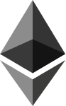

  Welcome To CryptoSyndrome
  

  

 

I'm a highly skilled Full Stack Blockchain developer.  
I have solid experience with multi-blockchains : Solana, EVM, NEAR Protocol. Have rich experience with lots of NFT/FT mint, stake, marketplace, launchpad, raffle, auction, p2e games on Solana, EVM and NEAR. Now I'm gonna build a beautiful future of blockchain world. 
 

I aim : 
 
:zap: Creative Idea Builder 
:zap: Well Structured Project Design 
:zap: High Quality Code 
:zap: Elegant Interface 
:zap: Client Satisfaction 
:zap: Earnest Manner 
   
  🤝 Contact with me 🤝
    
   
   
   
   
 
     
<h3>Top Skills</h3>

  

    <code></code>
    <code></code>
    <code></code>
    <code></code>
    <code></code>
    <code></code>
    <code></code>
    <code></code>
    <code></code>
    <code></code>
    <code></code>
    <a href="https://www.java.com" target="_blank"> 
      <code></code>
    </a> 
    <a href="https://www.qt.io/" target="_blank">
      <code></code>
    </a>    
    <code></code>
    <code></code>
    <code></code>
    <code></code>
    <code></code>
    <a href="https://www.gatsbyjs.com/" target="_blank">
      <code></code>
    </a>
    <code></code>
    <code></code>
    <code></code>
    <code></code>
    <code></code>
    <a href="https://redux.js.org" target="_blank">
      <code></code>
    </a>
    <a href="https://redis.io" target="_blank">
      <code></code>
    </a>
     <a href="https://firebase.google.com/" target="_blank"> 
       <code></code>
    </a>
    
<!--    
<a href="https://sass-lang.com" target="_blank"> 
       <code></code>
    </a>
 <a href="https://tailwindcss.com/" target="_blank"> 
      <code></code>
    </a>
<code></code>
    <code></code>
    <code></code> 
<a href="https://www.chartjs.org" target="_blank"> 
      <code></code>
    </a> 
<a href="https://www.electronjs.org" target="_blank"> 
      <code></code>
    </a>
-->
    
    
    
  

<!-- 
 
 
-->
<!-- <h2 align="left" id="macropower-tech">Github Status</h2> -->

<!-- > GitHub Profile Status -->

<!-- 

    
    

 -->

<!-- > GitHub Activity Graph -->

<!-- https://github.com/ashutosh00710/github-readme-activity-graph -->
<!--  -->

 

  
  
  

